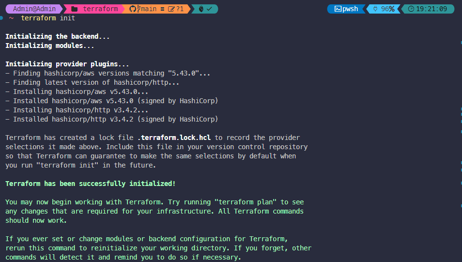

# Demo-WorkshopAWS-Using-Terraform

I will build infrastructure based on this workshop which I have made to submit to mission 1 of my First Cloud Journey Program.
- Link to the workshop: [Workshop](https://thnbao22.github.io/)

- Some AWS services I use in this workshop include VPC, EC2, S3, and Gateway Endpoint that supports private connection to S3 Bucket.

- Architecture:


- So I have completely done coding infrastructure for the architecture in the workshop.
- I will soon complete the demo of this project.

# Demo

1. Before deploying infrastructure, you need to access to your AWS account and create an access/secret key 


2. Clone this repository
```
git clone https://github.com/thnbao22/Demo-WorkshopAWS-Using-Terraform.git
```

3. After cloning this repository, please open the project in Visual Studio Code and navigate to the **terraform** folder using the **cd** command on the terminal of Visual Studio Code


4. After successfully navigating to the **terraform** folder, you can run the following command
```
terraform init 
```



5. After you run the command successfully, you can see there are some folders appear in the **terraform** folder


6. You can access the AWS Management Console, search for EC2 and create a key pair.


7. You also need to create an access/secret key and include it in the file **main.tf** in the **terraform** folder


8. Navigate to the **terraform** folder, using the command below to preview the changes that Terraform plans to make to your infrastructure.
```
terraform plan
```


9. You can see some resources are being created.

