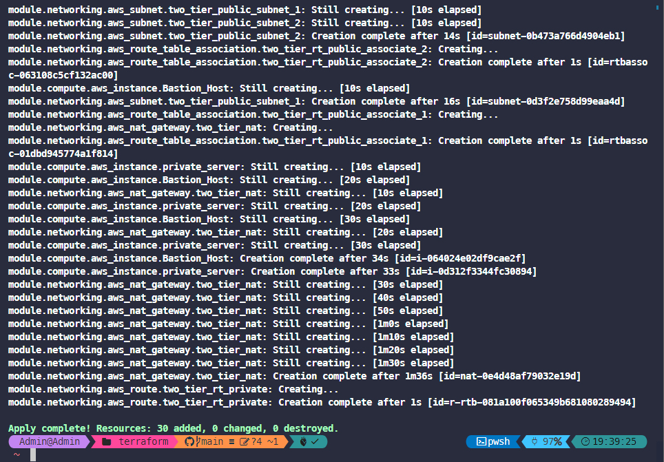
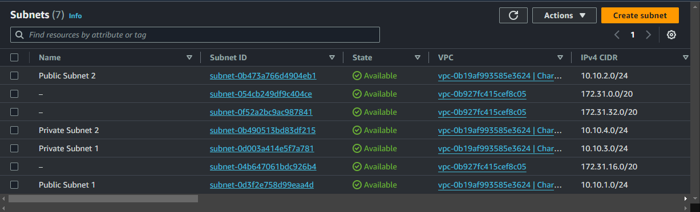
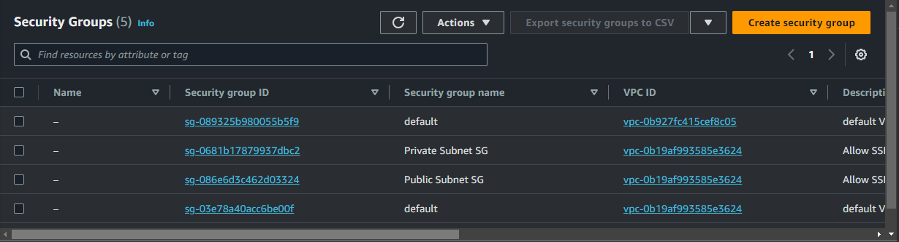

# Demo-WorkshopAWS-Using-Terraform

I will build infrastructure based on this workshop which I have made to submit to mission 1 of my First Cloud Journey Program.
- Link to the workshop: [Workshop](https://thnbao22.github.io/)

- Some AWS services I use in this workshop include VPC, EC2, S3, and Gateway Endpoint that supports private connection to S3 Bucket.

- Architecture:


- So I have completely done coding infrastructure for the architecture in the workshop.
- I will soon complete the demo of this project.

# Demo

1. Before deploying infrastructure, you need to access to your AWS account and create an access/secret key 


2. Clone this repository
```
git clone https://github.com/thnbao22/Demo-WorkshopAWS-Using-Terraform.git
```

3. After cloning this repository, please open the project in Visual Studio Code and navigate to the **terraform** folder using the **cd** command on the terminal of Visual Studio Code


4. After successfully navigating to the **terraform** folder, you can run the following command
```
terraform init 
```


5. After you run the command successfully, you can see there are some folders appear in the **terraform** folder


6. You can access the AWS Management Console, search for EC2 and create a key pair.


7. You also need to create an access/secret key and include it in the file **main.tf** in the **terraform** folder


8. Navigate to the **terraform** folder, using the command below to preview the changes that Terraform plans to make to your infrastructure.
```
terraform plan
```


9. You can see some resources will be created.


10. Then, you can use this command to executes the actions proposed in a Terraform plan.

```
terraform apply -auto-approve
```


11. After you run the command, you will see some resources are being created.



12. VPC:


13. Subnets



14. Route Tables


- Subnet associations of Route Table Private
  


- Routes


- Subnet associations of Route Table Public
  


- Routes


15. Security Groups



- Inbound rules


16. Internet Gateway


17. NAT gateway


18. S3 Gateway Endpoint


19. S3 Bucket


20. EC2 Server


27. Then you can follow the workshop to perform some actions between EC2 and S3. Know how EC2 can privately connect to S3.

28. After finishing the workshop, you can automatically delete the resource by using the following command.
```
terraform destroy -auto-approve
```


29. After running the command, you can see that the resources have been completely deleted.

